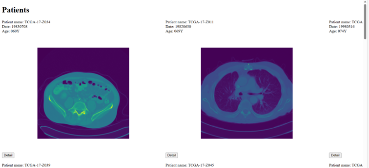
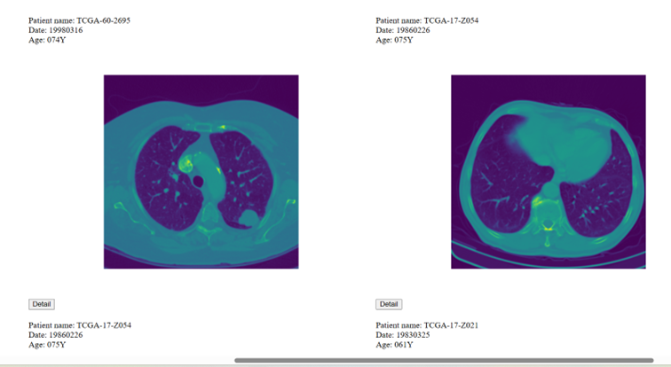
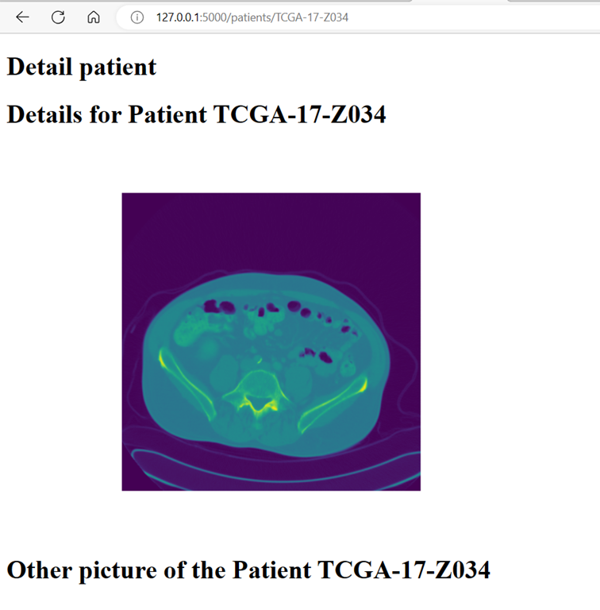
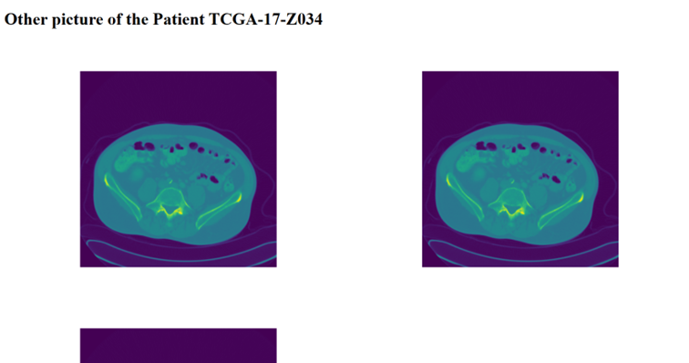
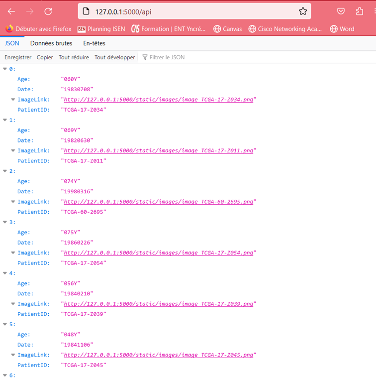
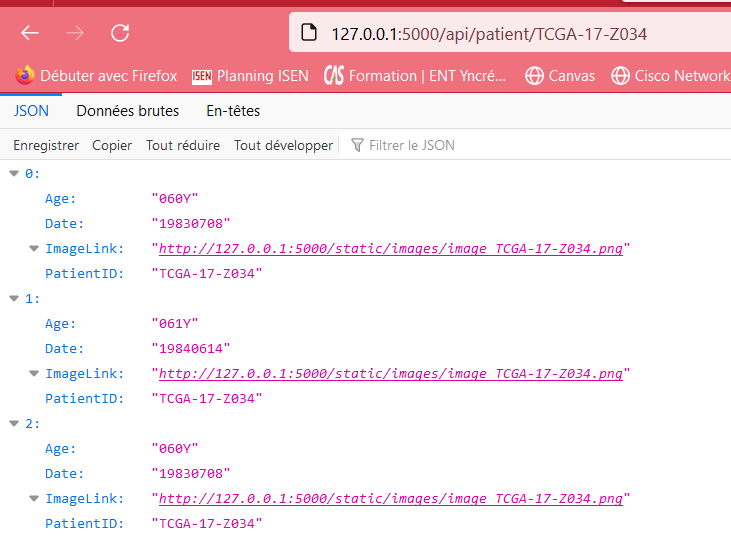

# EXAM HI 17/07/2023
# Coding by Léa MERIEN

## Installation
To run the application: 

Run the server by typing:
´´´
flask run
´´´

## Some of the result
## please note that the images were taken when all the .dcm files were not yet downloaded
The page for the URL:http://127.0.0.1:5000/

The page for the URL: http://127.0.0.1:5000/patient/patient_id

The page for the URL: http://127.0.0.1:5000/api

The page for the URL: http://127.0.0.1:5000/api/patient/patient_id

